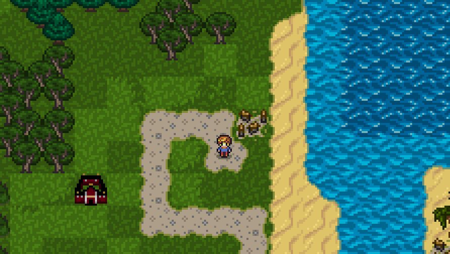
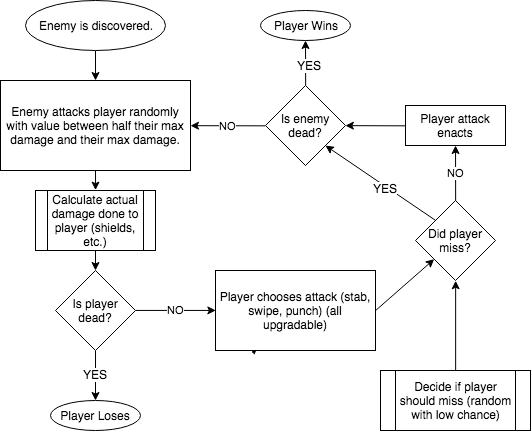

# Excalibur

An old school RPG game with turn based battles and animations that takes place
on an island.

## Problem Definition

-   A large 100x100 map loaded in from a file
-   A spritesheet to handle all the textures
-   An animated Character that can move
-   Enemies
    -   Enemy AI
    -   Enemy stats and textures
    -   random spawning of enemies
-   Combat and Combat UI
-   Leveling up
-   Player and enemy death
-   Player respawning and saving

## System Flow Chart

## Gantt Chart

|                     Task | D1  | D2  | D3  | D4  | D5  | D6  |
| -----------------------: | :-: | :-: | :-: | :-: | :-: | :-: |
|       Problem Definition | ▒✓▒ |     |     |     |     |     |
|        System Flow Chart | ▒✓▒ |     |     |     |     |     |
|              Gantt Chart | ▒▒▒ |  ✓  |     |     |     |     |
|          Data Dictionary |     |     |     |     |     | ▒✓▒ |
| Setup and Framework Init |     | ▒▒▒ | ▒▒▒ |  ✓  |     |     |
|                      Map |     | ▒▒▒ | ▒▒▒ |  ✓  |     |     |
|       Character Function |     |     | ▒▒▒ |     |  ✓  |     |
|                UI Popups |     |     |     | ▒▒▒ |  ✓  |     |
|                   Combat |     |     |     |     | ▒▒▒ | ▒✓▒ |
|                  Enemies |     |     |     |     | ▒▒▒ | ▒✓▒ |
|                   Saving |     |     |     |     |     | ▒✓▒ |

## Data Dictionary

|       Field Name |   Data Type   |                                                                     Data Format                                                                      | Field Size | Description                                                                                            | Example                                                              |
| ---------------: | :-----------: | :--------------------------------------------------------------------------------------------------------------------------------------------------: | :--------: | ------------------------------------------------------------------------------------------------------ | :------------------------------------------------------------------- |
|     PLAYER_SPEED |     Float     |                                                                     (primitive)                                                                      |  8 bytes   | Player movement speed in pixels/second                                                                 | 20                                                                   |
|         CAM_ZOOM |     Float     |                                                                     (primitive)                                                                      |  8 bytes   | Camera Zoom Level                                                                                      | 5                                                                    |
|         CAM_MODE |    String     |                                                                     (primitive)                                                                      |  6 bytes   | Camera follow type that determines how the camera will act                                             | &quot;smooth&quot;                                                   |
|        CAM_LIMIT |     Float     |                                                                     (primitive)                                                                      |  8 bytes   | The camera pan distance limit                                                                          | 100                                                                  |
|  FIGHT_BOX_WIDTH |     Float     |                                                                     (primitive)                                                                      |  8 bytes   | Width of the fight box UI                                                                              | 100                                                                  |
| FIGHT_BOX_HEIGHT |     Float     |                                                                     (primitive)                                                                      |  8 bytes   | Height of the fight box UI                                                                             | 70                                                                   |
|      ENEMY_COUNT |     Float     |                                                                     (primitive)                                                                      |  8 bytes   | Amount of enemies that will spawn on the map                                                           | 100                                                                  |
|  ENEMY_AGRO_DIST |     Float     |                                                                     (primitive)                                                                      |  8 bytes   | Base number for how far away the player needs to be from an enemy for it to start following the player | 5                                                                    |
|      ENEMY_SPEED |     Float     |                                                                     (primitive)                                                                      |  8 bytes   | default enemy movement speed in pixels/second                                                          | 10                                                                   |
|   PLAYER_ENABLED |     Bool      |                                                                     (primitive)                                                                      |  8 bytes   | Whether the player can move or not                                                                     | True                                                                 |
|    DEBUG_ENABLED |     Bool      |                                                                     (primitive)                                                                      |  8 bytes   | Whether the debug tools are enabled or not                                                             | False                                                                |
|  PLACEMENT_TILES |  Array(int)   |                                                                    [NNN, NNN, …]                                                                     |    120     | The locations that enemies can spawn (max 15 tiles)                                                    | [123, 123, 321]                                                      |
|      ENEMY_TYPES | Array(string) |                                                                   [WORD, WORD, …]                                                                    |     80     | The list of different enemy types (max 8 enemies)                                                      | [&quot;funny&quot;, &quot;words&quot;, &quot;here&quot;]             |
|       ENEMY_DATA |    Object     | **_{ enemyName:_** _{ stats: { speed: enemySpeed, sight:enemySight, attack:enemyAttack}, frame: enemyFrameName}_, **_enemyName2:_** \_{...}\_**_}_** |     10     | The object that contains all the data and stats of all the different enemy types                       | {"Skeleton": stats:{speed:10, sight:5, attack:5}, frame: "skeleton"} |
